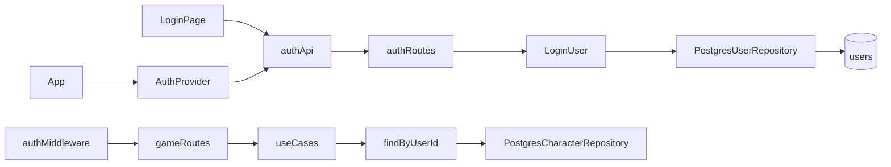

# Auth Design

**Spec**: `.specs/features/auth/spec.md`
**Status**: Approved

## Architecture Overview



## Data Model

**Migration `202609140007`**

```sql
CREATE TABLE users (
  id UUID PRIMARY KEY,
  email VARCHAR(255) NOT NULL UNIQUE,
  password_hash TEXT NOT NULL,
  display_name VARCHAR(100) NOT NULL,
  role VARCHAR(20) NOT NULL CHECK (role IN ('ADMIN', 'PLAYER')),
  created_at TIMESTAMPTZ NOT NULL DEFAULT NOW(),
  updated_at TIMESTAMPTZ NOT NULL DEFAULT NOW()
);

ALTER TABLE characters ADD COLUMN user_id UUID UNIQUE REFERENCES users(id) ON DELETE CASCADE;
```

Seed: create admin user, link existing seed character via `user_id`.

## API

| Method | Path | Auth | Role |
| ------ | ---- | ---- | ---- |
| POST | `/api/v1/auth/login` | Public | — |
| GET | `/api/v1/auth/me` | Bearer | any |
| GET | `/api/v1/users` | Bearer | ADMIN |
| POST | `/api/v1/users` | Bearer | ADMIN |
| PATCH | `/api/v1/users/:id` | Bearer | ADMIN |

All existing game routes gain `authenticate` middleware.

## JWT

- Secret: `JWT_SECRET` env (default dev fallback documented)
- Expiry: `JWT_EXPIRES_IN` default `7d`
- Payload: `{ sub, role, characterId }`

## Middleware

1. `authenticate` — parse Bearer, verify JWT, attach `req.auth`
2. `requireRole(...roles)` — 403 if role not in list

## Character scoping

Replace `findDefault()` with `findByUserId(userId: string)` across use cases. Routes pass `req.auth.userId`.

## Web

- `AuthProvider` — token state, login/logout, bootstrap `/auth/me`
- `api/client.ts` — inject Authorization header, 401 handler
- `LoginPage` — background image + form
- `App.tsx` — gate on `isAuthenticated`
- `UsersPage` — ADMIN only nav item

## Env

| Variable | Default (dev) |
| -------- | ------------- |
| `JWT_SECRET` | `dev-jwt-secret-change-me` |
| `JWT_EXPIRES_IN` | `7d` |
| `SEED_ADMIN_EMAIL` | `admin@gamefication.local` |
| `SEED_ADMIN_PASSWORD` | `admin123` |

## Risks

| Risk | Mitigation |
| ---- | ---------- |
| Breaking existing API consumers | Migration links seed character to admin |
| Token in localStorage XSS | MVP acceptable; httpOnly cookies in v2 |
| findDefault removal breaks tests | Update test repos with findByUserId |
