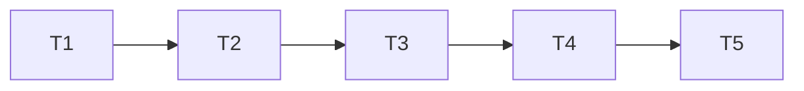
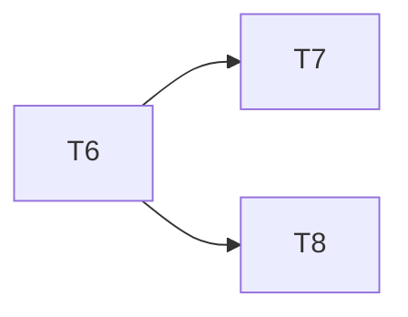

# Auth Tasks

## Gate Check Commands

| Gate | Command |
| ---- | ------- |
| api-unit | `npm run test -w @gamefication/api` |
| api-typecheck | `npm run typecheck -w @gamefication/api` |
| web-build | `npm run build -w @gamefication/web` |
| full | `npm run check` |

## Test Coverage Matrix

| AC / Requirement | Test |
| ---------------- | ---- |
| AUTH-01 login success | LoginUser.test.ts |
| AUTH-01 invalid credentials | LoginUser.test.ts |
| AUTH-01 unauthorized route | authenticate.test.ts |
| AUTH-02 PLAYER forbidden users | requireRole.test.ts |
| AUTH-02 scoped character | GetCharacter.test.ts |
| AUTH-03 login UI | web build |
| AUTH-04 admin users UI | web build |

## Execution Plan

### Phase 1 — API

### T1: Migration users + character link
**Depends on:** none
**Where:** `apps/api/src/infrastructure/database/migration/migrations/202609140007__users_and_auth.ts`
**Tests:** migration applies
**Gate:** api-unit

### T2: User domain + crypto + JWT
**Depends on:** T1
**Where:** `apps/api/src/domain/user/User.ts`
**Tests:** User.test.ts, PasswordHasher.test.ts, JwtService.test.ts
**Gate:** api-unit

### T3: User repository + auth use cases
**Depends on:** T2
**Where:** `apps/api/src/application/usecase/auth/LoginUser.ts`
**Tests:** LoginUser.test.ts, CreateUser.test.ts, ListUsers.test.ts
**Gate:** api-unit

### T4: Auth middleware + routes
**Depends on:** T3
**Where:** `apps/api/src/interfaces/http/middleware/authenticate.ts`
**Tests:** authenticate.test.ts, requireRole.test.ts
**Gate:** api-unit

### T5: Scope character to userId
**Depends on:** T4
**Where:** `apps/api/src/application/repository/CharacterRepository.ts`
**Tests:** GetCharacter.test.ts and related use case tests
**Gate:** api-unit

### Phase 2 — Frontend

### T6: Auth API client + AuthProvider
**Depends on:** T4
**Where:** `apps/web/src/lib/auth/AuthProvider.tsx`
**Tests:** typecheck via web-build
**Gate:** web-build

### T7: Login page with Login.png
**Depends on:** T6
**Where:** `apps/web/src/pages/LoginPage.tsx`
**Tests:** web build
**Gate:** web-build

### T8: Admin Users page
**Depends on:** T6
**Where:** `apps/web/src/pages/UsersPage.tsx`
**Tests:** web build
**Gate:** web-build

## Task Breakdown

See Execution Plan above. Eight tasks across two phases; fits a single execution batch.
