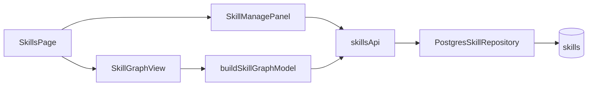

# Custom Skills Design

**Spec**: `.specs/features/custom-skills/spec.md`
**Status**: Approved

## Architecture Overview

Persist skill hierarchy in PostgreSQL. Extend read/write skill API. Frontend builds the graph from `parentSkillId` instead of `skillGraphDefinition.ts` structure (definition kept only for category virtual roots / labels).

## Code Reuse

| Component | Location | Use |
| --------- | -------- | --- |
| Skill tree layout | `layoutSkillGraph.ts` | Unchanged layout engine |
| Panel / tokens | `components.css`, `Panel.tsx` | Sidebar forms + modal |
| Quest form patterns | `QuestsPage.tsx`, parse*Body | Validation style |
| CharacterSkill.create | domain | Progress row on skill create |

## Data Model

**Migration `202609140004`**

- `skills.description TEXT NULL`
- `skills.parent_skill_id UUID NULL REFERENCES skills(id) ON DELETE RESTRICT`
- `skills.is_custom BOOLEAN NOT NULL DEFAULT FALSE`
- Backfill `parent_skill_id` from `skillParentBySlug.ts`

## API

| Method | Path | Purpose |
| ------ | ---- | ------- |
| POST | `/api/v1/skills` | Create custom skill |
| PATCH | `/api/v1/skills/:id` | Update name, description, parent |
| DELETE | `/api/v1/skills/:id` | Delete custom skill |

## UI (Skills page sidebar)

1. **Manage toggle** — enables move/delete/create actions
2. **Create form** — name, optional description, parent = selected tree node (or category root)
3. **Move flow** — select skill → click "Move here" on target node
4. **Description modal** — triggered from detail strip info button

## Risks & Concerns

| Risk | Mitigation |
| ---- | ---------- |
| Hardcoded graph drift | Seed migration + API-driven graph |
| Cycle on reparent | Domain validation before save |
| Orphan character_skills | Create progress in same transaction as skill |
